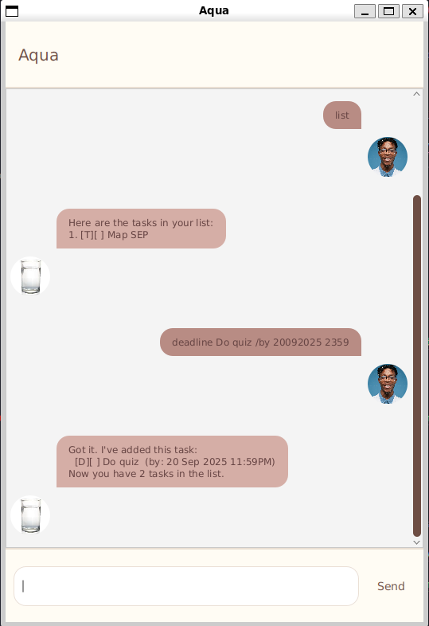

# Aqua User Guide

Aqua is a task management chatbot that supports a variety of commands for managing todos, deadlines, events, and priorities.

\
Note:
- All commands are **case-insensitive**.
- Data are saved locally on every command run, you don't have to worry about losing your data if you exit the program prematurely.

---

## 📋 Command List
### 1. Show all tasks
```
list
```
Displays all tasks currently stored, along with their index and status.
#### Expected Output:
```
Here are the tasks in your list:
  1. [D][ ] Do quiz (by: 20 Sep 2025 11:59PM)
  2. [T][X] Buy groceries
```

### 2. Add a Todo
```
todo <description>
```
Adds a new todo task.
#### Example:
```
todo Buy groceries
```
#### Expected Output:
```
Got it. I've added this task:
  [T][ ] Buy groceries
Now you have 2 tasks in the list.
```

### 3. Add a Deadline
```
deadline <description> /by <date>
```
Adds a deadline task with a due date.
#### Example:
```
deadline Submit assignment /by 20092025
```
#### Expected Output:
```
Got it. I've added this task:
  [D][ ] Do quiz (by: 20 Sep 2025 11:59PM)
Now you have 1 tasks in the list.
```

### 4. Add a Event
```
event <description> /from <date> /to <date>
```
Adds an event task with a start and end date/time.
#### Example:
```
event Project meeting /from 20092025 14:00 /to 20092025 16:00
```
#### Expected Output:
```
Got it. I've added this task:
  [E][ ] Meeting (from: 20 Sep 2025 02:00PM, to: 20 Sep 2025 04:00PM)
Now you have 1 tasks in the list.
```

### 5. Mark a Task as Done
```
mark <index>
```
Marks the task at the given index as done.
#### Example:
```
mark 2
```
#### Expected Output:
```
Okay! I've marked this task as done:
  [T][X] Buy groceries
```

### 6. Unmark a Task
```
unmark <index>
```
Marks the task at the given index as not done.
#### Example:
```
unmark 2
```
#### Expected Output:
```
Okay! I've marked this task as not done yet:
  [T][ ] Buy groceries
```

### 7. Set Task Priority
```
priority <index> <priority>
```
Sets a priority level for a task.

**Priority levels:**
- `0` → Low
- `1` → Medium
- `2` → High
#### Example:
```
priority 3 2
```
##### or:
```
priority 3 high
```
#### Expected Output:
```
Okay! I've updated priority of this task:
  [T][X] Buy groceries (Priority: HIGH)
```

### 8. Delete a Task
```
delete <index>
```
Removes the task at the given index.
#### Example:
```
delete 4
```
#### Expected Output:
```
Note. I've removed this task:
  [E][ ] Meeting (from: 20 Sep 2025 02:00PM, to: 20 Sep 2025 04:00PM)
Now you have 1 tasks in the list.
```

### 9. Find Tasks
```
find <keyword>
```
Searches for tasks containing the keyword. Keyword is case-sensitive.
#### Example:
```
find project
```
#### Expected Output:
```
Here are the matching tasks in your list:
  1. [E][ ] Meeting (from: 20 Sep 2025 02:00PM, to: 20 Sep 2025 04:00PM)
```

### 10. Exit the Program
```
bye
```
Exits Aqua.

## 📅 Supported Date Formats

Aqua accepts the following date formats for **deadline** and **event** commands:

- `ddMMyyyy`
- `ddMMyyyy HH:mm`
- `ddMMyyyy HHmm`
- `dd-MM-yyyy HHmm`
- `dd-MM-yyyy HH:mm`
- `dd-MM-yyyy`
- `dd-MM-yyyy HHmm`
- `dd-MM-yyyy HH:mm`
- `dd/MM/yyyy`
- `yyyy-MM-dd`
- `yyyy-MM-dd HH:mm`
- `yyyy-MM-dd'T'HH:mm`
- `yyyy-MM-dd'T'HH:mm:ss`